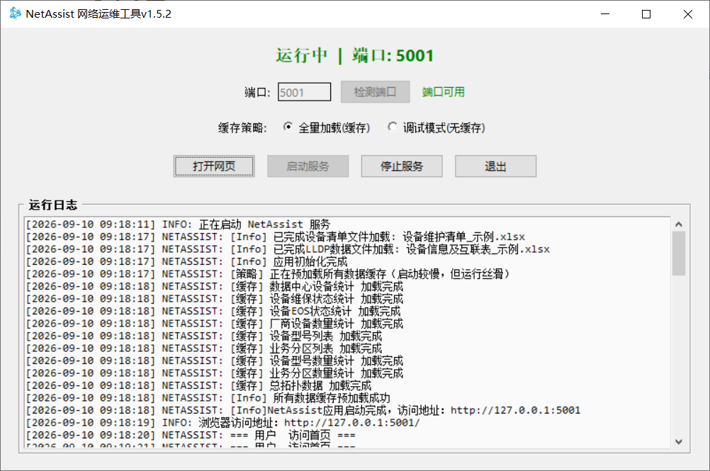
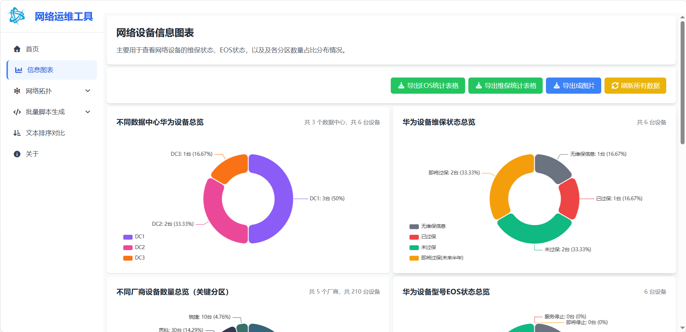
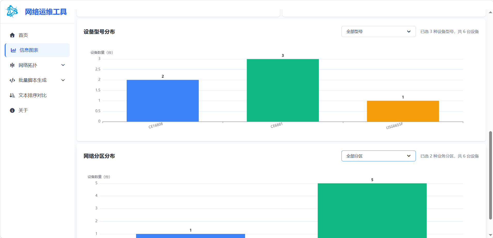
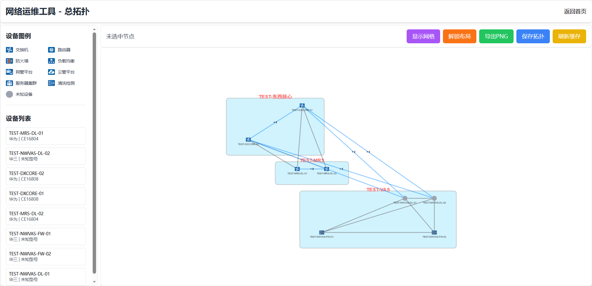
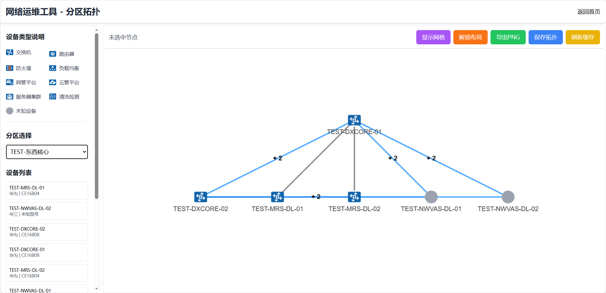
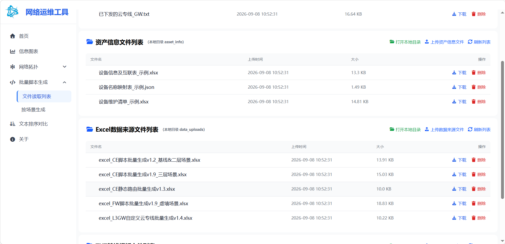
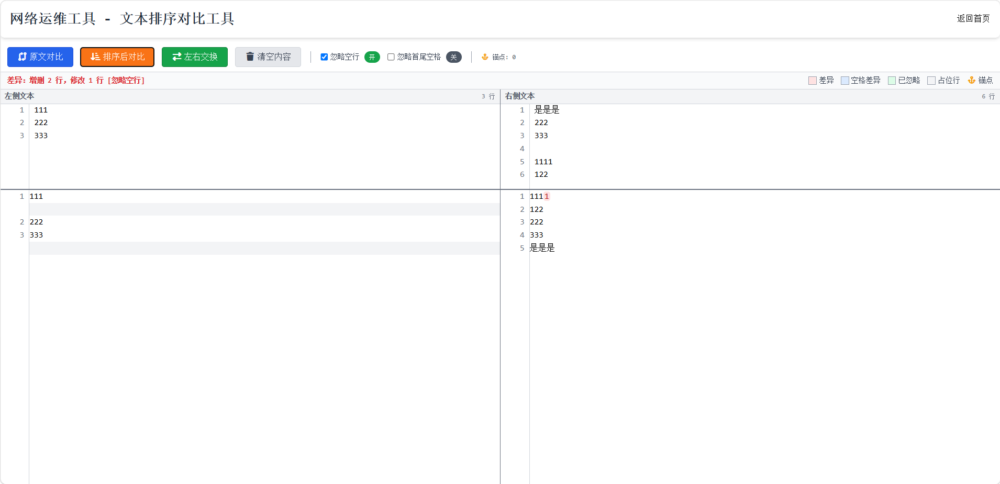
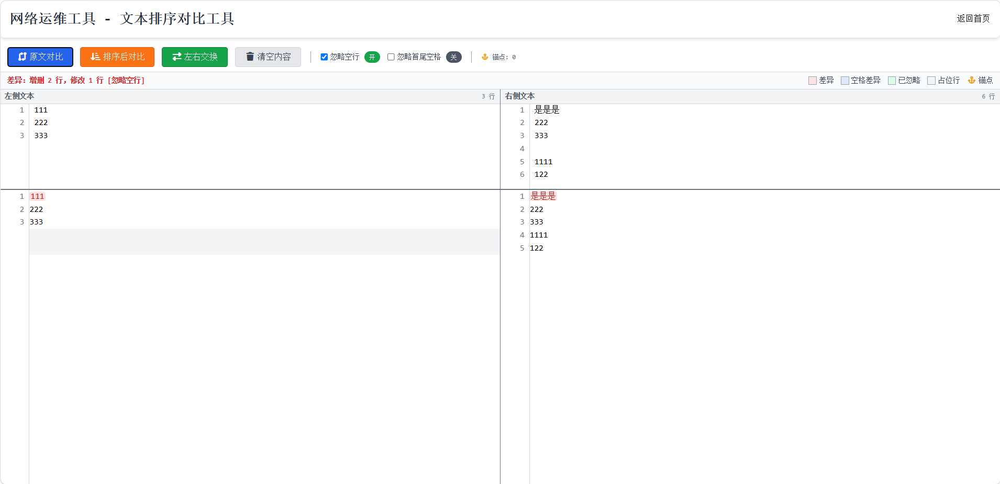

<div align="center">

# NetAssist 网络运维工具


**面向网络工程师的本地运维工具箱：设备资产统计可视化、LLDP 自动拓扑、多场景批量脚本生成、文本对比。**

[项目地址](https://github.com/Wenshixiong/NetAssist) · [QQ 交流群：1098907087](https://qm.qq.com/q/1098907087) · 反馈邮箱：1205244490@qq.com

[English](README_EN.md)

</div>

## 界面预览

| GUI 启动器 | 首页 |
|---|---|
|  |  |

---

## 功能特性

### 信息图表
基于设备维护清单 Excel，自动统计并可视化：
- **维保状态**：无维保 / 已过保 / 即将过保（半年内）/ 未过保，支持一键导出明细 Excel
- **EOS 状态**：服务停止 / 即将停止（2 年内）/ 服务中 / 无 EOS 信息，支持导出明细
- **设备分布**：按数据中心、业务分区、厂商、设备型号多维度统计数量与占比
- **交互筛选**：支持按型号、业务分区联动过滤
- 自动排除红色底色标记的下架设备及板卡型号（CE- / CEL / CR 前缀）




### 网络拓扑
基于 LLDP 采集的设备互联数据，使用 Cytoscape.js 渲染：
- **网络总拓扑**：全局架构展示，支持节点拖拽、缩放、悬停查看设备详情
- **网络分区拓扑**：按业务分区独立展示，自动筛选该分区内的设备与链路
- **坐标持久化**：拖拽后的节点坐标自动回写至 Excel，下次打开恢复布局
- 支持拓扑图导出为图片




### 批量脚本生成
插件式架构，根据 Excel 数据源批量生成**变更脚本 + 回退脚本**，内置 5 种场景：

| 场景模块 | 说明 |
|---|---|
| CE 基线 & 二层场景 | 交换机基础配置 + 二层业务，支持 MLAG 模板 |
| CE 三层场景 | 交换机三层接口 / 路由配置 |
| CE 静态路由 | 静态路由批量下发 |
| FW 虚墙场景 | 防火墙虚墙（vsys）配置 |
| L3GW 自定义云专线 | 自定义云专线批量生成 |

- 支持模板文件、数据源 Excel、设备名称映射表、自定义云专线文件的上传 / 下载 / 预览 / 删除
- 生成结果支持单文件下载或全部打包 ZIP 下载




### 文本排序对比
- 对两段文本分别排序后进行差异对比（基于 diff.js）
- 快速定位配置文件、命令输出之间的差异




---

## 技术栈

| 层级 | 技术 |
|---|---|
| 后端 | Python 3.11 · Flask 3.1 · waitress（生产 WSGI） |
| GUI 启动器 | tkinter · pystray（系统托盘） |
| 数据处理 | pandas · openpyxl · python-dateutil |
| 系统监控 | psutil |
| 前端 | Tailwind CSS · ECharts · Cytoscape.js · Font Awesome |
| 打包 | PyInstaller（`--onefile` 单文件） |

---

## 快速开始

### 环境要求
- Python 3.11（开发与测试环境）
- Windows / macOS / Linux（GUI 启动器与系统托盘在 Windows 体验最佳）

### 安装依赖

```bash
pip install -r requirements.txt
```

### 启动

**方式一：GUI 启动器（推荐）**

```bash
python launch_v1.5.2.py
```

弹出图形化管理器，可配置端口、选择缓存策略、查看运行日志，支持系统托盘最小化。点击「启动服务」后访问 `http://127.0.0.1:5001`。

**方式二：直接启动 Web 服务**

```bash
python NetAssist_v1.5.2.py
```

服务默认监听 `0.0.0.0:5001`。

### 缓存策略

| 策略 | 环境变量 | 说明 |
|---|---|---|
| 全量加载（默认） | `NETASSIST_PRELOAD=true` `NETASSIST_USE_CACHE=true` | 启动时预加载所有统计数据，图表秒开 |
| 调试模式 | `NETASSIST_PRELOAD=false` `NETASSIST_USE_CACHE=false` | 每次请求实时计算，同时开启 DEBUG 日志 |

也可通过 `/refresh_cache` 接口按需刷新指定缓存键。

---

## 目录结构

```
NetAssist/
├── NetAssist_v1.5.2.py      # Flask 主应用
├── launch_v1.5.2.py         # tkinter GUI 启动器 + 系统托盘
├── version.py               # 版本元数据（唯一版本来源）
├── bump_version.py          # 版本递增工具
├── requirements.txt         # 依赖清单
├── 打包命令.txt               # PyInstaller 打包命令参考
├── LICENSE                  # Apache 2.0
├── RELEASE.md               # 版本发布说明
├── html/                    # Jinja2 模板
│   ├── base.html            # 布局骨架（侧边导航）
│   ├── index.html           # 首页
│   ├── about.html           # 关于（含完整许可证）
│   ├── info_chart.html      # 信息图表
│   ├── topology/            # 总拓扑 / 分区拓扑
│   └── work/                # 文件管理 / 场景生成 / 文本对比
├── static/
│   ├── css/output.css       # Tailwind 编译产物
│   ├── css/topology_tooltips.css
│   ├── js/                  # ECharts / Cytoscape / diff / html-to-image
│   ├── fontawesome-free/    # 图标库（CSS + webfonts）
│   ├── icons/               # 应用图标与设备类型图标
│   └── TailwindCSS_CLI/     # Tailwind 编译环境（package.json + tailwind.config.js）
├── imported_mods/           # 插件式脚本生成模块（5 个场景）
├── asset_info/              # 资产数据（设备清单 / LLDP 互联表 / 名称映射表）
├── data_uploads/            # 脚本生成数据源 Excel（可上传）
│   └── custom_line_uploads/ # 自定义云专线文件
├── templates_uploads/       # 脚本模板文件（可上传）
└── generated_scripts/       # 脚本生成输出目录（运行时自动创建）
```

---

## 数据文件说明

应用启动时校验 `asset_info/` 下的两个核心 Excel，缺失则拒绝启动。可通过 `asset_info/设备清单及拓扑映射表_示例.txt` 指定实际文件名：

```ini
EXCEL_FILENAME=设备维护清单.xlsx
LLDP_FILENAME=设备信息及互联表.xlsx
```

### 设备维护清单.xlsx
| Sheet | 用途 | 关键列 |
|---|---|---|
| 设备清单 | 设备资产主表 | 设备型号、数据中心、业务分区、维保开始/结束、序列号、管理地址 |
| 设备EOS信息 | 型号 → EOS 时间映射 | 设备型号、设备EOS时间 |
| 其他厂商设备数量 | 厂商设备数量汇总 | 厂商、数量 |

> 红色底色行自动视为下架设备并排除；`CE-` / `CEL` / `CR` 前缀视为板卡并排除。

### 设备信息及互联表.xlsx（LLDP）
| Sheet | 用途 | 关键列 |
|---|---|---|
| 设备基础信息表 | 设备静态信息 | 设备名称、所属分区、所属数据中心、序列号SN、MAC地址、设备型号、管理地址、是否在总拓扑体现 |
| 设备分区坐标表 | 拓扑节点坐标 | 设备名称、当前分区、topology_x、topology_y |
| 设备分区互联表 | 设备链路关系 | 所属分区、本端设备名称、本端设备接口、远端设备名称、远端设备接口 |

---

## 样式开发（Tailwind CSS）

项目使用 Tailwind CSS CLI 编译样式，源码位于 `static/TailwindCSS_CLI/`：

```bash
cd static/TailwindCSS_CLI
npm install          # 首次需安装依赖（仅 tailwindcss 一个包）
npx tailwindcss -i ./src/input.css -o ../css/output.css --watch
```

- 输入源：`src/input.css`（含自定义工具类 `sidebar-active`、`nav-item-hover`）
- 输出产物：`static/css/output.css`
- 扫描范围：`tailwind.config.js` 中配置的 `../js/*.js` 和 `../../html/**/*.html`
- 新增 HTML 中的 Tailwind 类名后，`--watch` 模式会自动重新编译

---

## 打包为 exe

```bash
pip install pyinstaller
pyinstaller --noconsole --onefile --name "NetAssist_v1.5.2" --icon="static/icons/NetAssist_64.ico" ^
    --add-data "asset_info;asset_info" ^
    --add-data "html;html" ^
    --add-data "templates_uploads;templates_uploads" ^
    --add-data "data_uploads;data_uploads" ^
    --add-data "imported_mods;imported_mods" ^
    --add-data "static/css;static/css" ^
    --add-data "static/icons;static/icons" ^
    --add-data "static/js;static/js" ^
    --add-data "static/fontawesome-free;static/fontawesome-free" ^
    launch_v1.5.2.py
```

首次启动 exe 时，`ensure_resources_once()` 会自动将示例 Excel、模板等从 exe 内部复制到 exe 所在目录。

---

## 开发说明

### 版本管理
版本号唯一来源为 `version.py`，使用 `bump_version.py` 统一递增并自动重命名主程序与启动器：

```bash
python bump_version.py              # 1.5.2 -> 1.5.3（patch）
python bump_version.py --minor      # 1.5.3 -> 1.6.0
python bump_version.py --major      # 1.6.0 -> 2.0.0
python bump_version.py --set 2.1.0  # 显式设置
```

### 新增脚本生成场景
1. 在 `imported_mods/` 中新增模块，暴露 `main(EXCEL_NAME, SHEET_NAME, OUTPUT_DIR, ROLLBACK_DIR, ...)` 入口
2. 在 `NetAssist_v1.5.2.py` 中通过 `load_module_from_path()` 动态加载
3. 在 `/generate_scripts` 路由中按数据源文件名关键字分发

### 环境变量
| 变量 | 默认 | 说明 |
|---|---|---|
| `FLASK_SECRET_KEY` | `dev_secret_key_should_be_changed` | Flask 会话密钥，生产环境务必修改 |
| `NETASSIST_PRELOAD` | `true` | 启动时是否预加载统计缓存 |
| `NETASSIST_USE_CACHE` | `true` | 请求是否使用缓存 |
| `NETASSIST_DEBUG` | `false` | 是否输出 DEBUG 级日志 |

---

## 许可证

本项目基于 [Apache License 2.0](LICENSE) 开源，Copyright © 2026 Wenshixiong/NetAssist。
